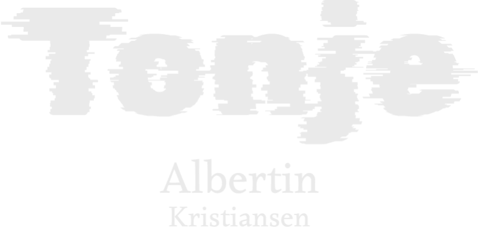

Portfolio Website

This portfolio showcases my development projects as a front-end development student. The website includes three featured projects, presented in a modern, responsive design.

Table of Contents

	•	About
	•	Features
	•	Technologies
	•	Live Demo
	•	Screenshots
	•	Installation
	•	Projects
	•	Contact

About

This portfolio was developed to demonstrate my skills in front-end development and showcase my work as a student. The website is designed with a professional yet creative look and feel to cater to potential employers, clients, or collaborators.

Features

	•	Modern Design: Clean, responsive layout optimized for various screen sizes.
	•	Interactive Header: Navigation with a dark mode toggle for user experience.
	•	Project Highlights: Each project card includes links to the GitHub repo and live demo.
	•	Responsive Design: Ensures usability across desktops, tablets, and mobile devices.

Technologies

	•	HTML
	•	CSS (including Flexbox and Grid)
	•	JavaScript
	•	Netlify for hosting

Live Demo

Visit the portfolio website here:
https://portofolio-tk.netlify.app/html/projects

Projects

1. Cross-Course Project

	•	Description: A project exploring responsive design using HTML and CSS.
	•	GitHub Repo: Link to Cross-Course Repo
	•	Live Demo: https://portofolio-tk.netlify.app/html/projects

    2. Semester Project 1

	•	Description: A more complex website with dynamic elements.
	•	GitHub Repo: Link to Semester Project Repo
	•	Live Demo: View Live

    3. Project Exam 1

	•	Description: An end-to-end front-end project showcasing my skills.
	•	GitHub Repo: Link to Project Exam Repo
	•	Live Demo: View Live

